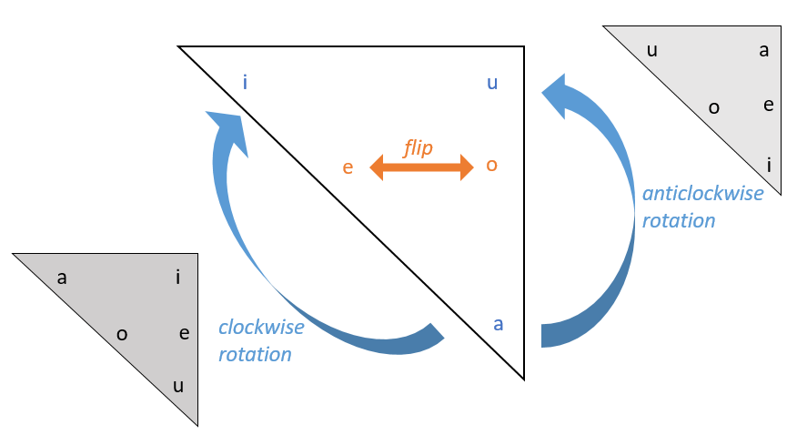
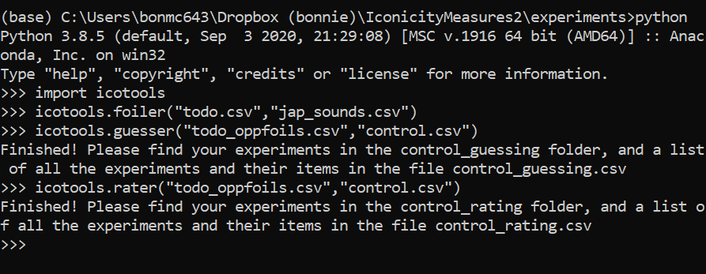

# General overview

Icotools is a [python package](https://pypi.org/project/icotools/). To install it, use `pip install icotools`.

Icotools comes with three functions:

- `icotools.rater('stimuli.csv','controlfile.csv')`
- `icotools.guesser('stimuli.csv','controlfile.csv')`
- `icotools.foiler('stimuli.csv','letters.csv')` 

The **rater** function makes rating experiments, where participants are presented with stimuli and their meanings, and asked to rate on a 7-point scale whether they think there is a resemblance between the stimulus and its meaning, from 0 'No resemblance' to 6 'Strong resemblance'. A demo is available [here](https://honestcookingblog.com/ratings/experiment1.html#). 

The **guesser** function makes guessing experiments, where participants are given a meaning and have to match the meaning to the correct stimulus, in a two alternative forced-choice paradigm. A demo is available [here](https://honestcookingblog.com/experiments/experiment1.html#). You can either:

(a) make guessing experiments where the foils for each item are specified, or   
(b) make guessing experiments where the foils for each item are randomly chosen from all the items available, with the option to specify particular item-foil pairings which should *not* be used.

If you don't specify your own foils, option (b) will be chosen automatically.

## Why specify foils?

We have found that words are usually guessed more accurately when paired with foils that are as different-sounding to them as possible, compared to when paired with random foils. Thus, using opposite foils can improve the sensitivity of your guessing experiments to iconicity, particularly in cases where the items you are testing are expected to exhibit only weak iconicity, when you do not have so many guesses per item, or when you do not have so many items in your study. We also think it is a more principled way to test for iconicity, since if a word does sound appropriate for a meaning, then a word that sounds very different to it should be *inappropriate* for that meaning. 

The function **foiler** provides a list of opposite-sounding words for each item in your experiment. At the moment, the **foiler** function is only supported for items that are *spoken language words or sounds* (able to be transcribed in IPA). If the items in your experiment are hand signs, gestures, or images, we recommend using random foils. As items in the visual modality are often higher in iconicity anyway, using opposite foils would be unlikely to greatly improve the sensitivity of the measure. However, if you have some way of choosing maximally contrastive signs/gestures/images to pair with your items, you are free to specify this in the 'foils' column of your stimuli file (see [here](#Format-for-stimuli-file)). For a full discussion of how to use the foiler function, and how it makes the opposite-sounding words, see [here](#instructions-for-using-the-foiler-function)

## Available stimuli types

At the moment, the following types of stimuli are supported:

- mp3 or wav 
- mp4
- images, including jpg, jpeg, png, svg, gif 

If you would like support for more types of stimuli, please request it in the 'Issues' section.

## How do the guessing and rating functions work? 

Each function takes a list of stimuli (stimuli.csv) and a control file (control.csv) as inputs, and produces a folder of html experiments to collect measures of iconicity on those items. For each experiment, three files are produced--a html file, a php file, and a csv file. Once you upload all these files to your server, and share the link to the html experiments with participants, as participants complete your study, their answers (as well as their reaction times for each item, and a record of which translation/foil was presented to them for each item) will be written to the csv file on your server (by the php). The functions also produce a summary csv file with all the details of the experiments (i.e. the trials in each experiment, as well as the translations and, where applicable, foils used).

There are examples in the 'examples' folder. The files `processguesses.R` and `processratings.R` are R scripts for combining the raw result files from the experiments into one long tidy dataset. 

# Format for control file

It should be a csv file with two columns, the first column contains variable names and the second column contains their values.

|Col1             |Col2                                                                                                             |
|-----------------|-----------------------------------------------------------------------------------------------------------------|
|media_source     |link to location of media files                                                                                  |
|media_type       |media format (either 'mp3','wav', 'mp4', 'jpg', 'jpeg', 'png', 'svg', 'gif' )                                    |                                         
|mp4_type         |(if using mp4 format) specify either 'gesture' or 'sign' (for the wording in the questions)                      |
|muted_vids       |(optional) either 'y' or 'n' if you want to mute the audio in the videos (default is 'n')                        |
|language         |(optional) language of the stimuli (if you want to inform participants of that)                                  |
|headphone_check  |(for sounds/videos) do you want to include a headphone check at the start of the experiment--either 'y' or 'n'   |                                         
|instructions_html|either 'default' or provide filename to your own html instructions                                               |       
|exitques_html    |either 'default' or provide filename to your own html exit questions                                             |  
|exitques_labels  |(if not using default exit questions) a comma separated list of labels for your exit questions (for the csv file)|
|submit_html      |either 'default' or provide filename to your own html submit message (e.g. if you need to redirect participants) |
|words_per_exp    |roughly how many words would you like to test per experiment (excluding practice and control items)              |      

At the moment, I have only provided default instructions for tasks where the stimuli are sound files or videos. If you are using images then you should write your own custom instructions. 

The order of the variables doesn't matter.
Examples of control files are provided in the example folder.

# Format for stimuli file
It should be a csv file. The first three columns are required, but the last three are optional. Having extra columns (with stuff not relevant to the experiments) will not matter.

| form                                                         | item                                                         | meaning                                   | foils                                                        | no_foils                                                     | iconic                                                       |
| ------------------------------------------------------------ | ------------------------------------------------------------ | ----------------------------------------- | ------------------------------------------------------------ | ------------------------------------------------------------ | ------------------------------------------------------------ |
| the form to be tested--this should correspond to the name of your media files, e.g. if the form is honnori the media file should be called honnori.mp3 or honnori.mp4 etc. (depending on what you put in the control file) | either 'practice' (if it's a practice item), 'control' (if it's a control item) or 'trial' (if it's one of the items you're testing)--see explanation below table | one or more translations, separated by \| | the names of items you want to use as foils. These should match their media file names (as for the form column), and be separated by \| | the names of items you don't want to use as foils. These should match their media file names (as for the form column), and be separated by \| | if you want to have a roughly equal number of possibly iconic vs possibly not iconic words in each experiment, indicate your hypothesis about iconicity 'y' or 'n' here |

Practice and control items are included in every experiment (but you only have to list them in the stimuli file once). The practice items are always the first two items in every experiment, while the order of the trial items and the control items is randomised between participants. The choice of foil and the choice of translation (in the meaning column) is also randomly varied between participants (for the meanings/foils listed). If you don't list any foils, then the foil will be randomly chosen from the other trials. We recommend providing multiple translations in the meaning column for each trial where possible, so that the choice of translation does not too strongly influence the results. Try to choose translations that are similar in meaning, but different in sound (see the paper for more discussion). 

The meanings will also all be presented in CAPITALS during the experiment (regardless of how you write them in the stimuli file).

Examples are provided in the example folder.

# Instructions for using the foiler() function

To use the foiler function, you need to provide a csv file that shows how the letters in the transcription system that you use map to IPA, and how they should be substituted with one another. The first three columns are required, the last column is optional

| letter                                                       | ipa                                                          | group                                                        | substitute                                                   |
| ------------------------------------------------------------ | ------------------------------------------------------------ | ------------------------------------------------------------ | ------------------------------------------------------------ |
| the letters used for writing the words in your experiments (as in the 'form' column of the stimuli file). These can be single characters or digraphs, but please do not use three or more characters for a single sound | the IPA representation of the sound denoted by those letters | the name of the sound group to which that sound belongs. Sounds in the same group will be freely substituted for one another when building foils. To avoid the foils sounding too strange, we recommend at least having vowels and consonants in separate groups. The names you use for your sound groups are not important (they can be anything). See the example at 'examples/foilerexamples/japsounds.csv' | if you do not want foiler() to decide which sounds to substitute for that sound, but wish to specify your own substitutions, you can do that here. Separate multiple sounds with \|. We recommend doing this with vowels if the language you are working with has only a small vowel inventory, as the foiler picks at least three sounds to substitute for each sound, so if there's not that many vowels to choose from some of the substitute vowels chosen could be quite similar to the original vowel. When working with small vowel inventories, we recommend specifying just one or two vowels to substitute, and choosing them by taking the vowel that you get when rotating the vowel space 180 degrees clockwise or anticlockwise (see discussion below) |

## How does foiler make the foils?

See the code in 'icotools/foiler.py'. We can walk through an example with the word *fuwafuwa*.

If any of your items are reduplicated, the first thing foiler will do is get rid of this reduplication. So *fuwafuwa* becomes *fuwa*. It then looks at each sound in *fuwa*, and figures out the phonological distances between that sound and every other sound in the language with which it can be freely substituted (based on how you have defined your groups in the letters file).

The phonological distances are calculated using the feature matrix provided by PHOIBLE, found [here](https://github.com/phoible/dev/blob/5bb2f0e4e759544af4cbcecd04ab35106894b8af/raw-data/FEATURES/phoible-segments-features.tsv). The distance between two sounds is equal to the sum of the distances between each of their feature values: the distance between two feature values that are identical is 0, while the distance between two opposing values (+/- or -/+) is 1—except if the feature involved is length or voicing, then the distance if 0.5—and the distance between two feature values when one of them is 0 (=not applicable) is 0.25.

For each sound, foiler takes the top three sounds that are most phonologically distant from it to use as its substitutes. In the case where there are more than three sounds that are equally distant from it, it takes all the sounds. For example, in the case of /f/ for Japanese, the most phonologically distant sounds are /w/ (with a distance of 8), /y/ (with a distance of 7.5), /n/ (with a distance of 7), and /r/ (also with a distance of 7). In the case of /w/, the most phonologically distant sounds are /tː/ (with a distance of 10.75), and /ts/, /t/, /tʃ/ and /dː/ (all with a distance of 10.25).

If the sound group is small, as is often the case with vowels, you may wish to specify a smaller number of substitutions. I substitute the vowels with the vowel obtained by rotating the vowels at the endpoints of the vowel space triangle 120 degrees clockwise or counterclockwise, and flipping the vowels in the middle. So /u/ is substituted with either /a/ or /i/, /a/ is substituted with either /i/ or /u/, /i/ is substituted with either /a/ or /u/, and /e/ and /o/ are substituted with each other (see image below). 

Foiler then makes three foil words for each item, by randomly substituting sounds from among the most phonologically distant sounds, or among the specified substitution sounds. In the case of *fuwafuwa*, we then up with foil words like *watʃi*, *nati*, and *ridːu* (among other possibilities). 

Foiler produces two files, the first is your original stimuli list with a column 'foils' added to it, where you can see the foils it made for you. The second is a file 'substitutions.csv', where you can see which sounds were substituted with each other, and what the phonological distances were between them.

# Demo

Below is an example of how to use the functions in icotools from python:

You can find the input files in the folder 'examples/foiler_examples'.

# Default instructions

## Guesses - mp3/wav stimuli

'Japanese' will be replaced with whatever language you specify in the control file. If you don't specify a language, the instructions will just refer to 'an unknown language'.

>  
We are interested in how well people can guess words in foreign languages. In this experiment, you will be asked to match the English translation with the corresponding word in Japanese, guessing from a choice of two Japanese words.

>  
<strong>Criteria for participation</strong>

>  
Because your answers should be guesses, it is very important for our experiment that you do NOT speak or understand Japanese. Also, since the experiment requires you to listen to the words, you will need to complete it in a quiet place using headphones. We will check at the beginning of the experiment that you are using headphones, so please make sure to use them as participants who do not use headphones will not be able to complete the experiment.
 
>  
Participation is completely voluntary, anonymous and confidential. If you meet the above criteria and agree to participate, please click 'Participate'.

## Guesses - mp4 stimuli

Below are the instructions for signs, in this case from JSL. JSL will be replaced with whatever language you specify.

> We are interested in how well people can guess the meanings of signs in JSL. In this experiment, you will be asked to match the English translation with the corresponding sign in JSL, guessing from a choice of two JSL signs.  
> **Criteria for participation**  
> For your judgments to be unbiased, it is very important that you do NOT know any JSL. If you do know JSL, we kindly ask that you do not participate in this study.  
> Participation is completely voluntary, anonymous and confidential. If you meet the above criteria and agree to participate, please click 'Participate'.

Below are the instructions for gestures. If you specify a language then it will replace 'foreign' with the language you specify.

> We are interested in how well people can guess the meanings of foreign gestures. In this experiment, you will be asked to match the English translation with the corresponding gesture, guessing from between a choice of two gestures.
> Participation is completely voluntary, anonymous and confidential. If you meet the above criteria and agree to participate, please click 'Participate'.

## Ratings - mp3/wav stimuli

'Korean' will be replaced with whatever language you specify.

> Some words seem to 'fit' their meanings. For example, consider the English words *wiggle*, *jiggle*, and *wriggle*.  
> We have an intuitive sense of the meanings of these words, because there is a resemblance between the words and their meanings.  
> Even people who do not speak any English can get a sense of the meaning of these words.  
> Words like walk and run on the other hand are not so intuitive; people who do not know any English would not be able to guess what these words mean.  
> In this task, you will listen to some Korean words, and we will tell you their meanings. You will then be asked to judge whether there is a resemblance between the word and its meaning.  
> **Criteria for participation**  
> For your judgments to be unbiased, it is very important that you do NOT know any Korean. If you do know Korean, we kindly ask that you do not participate in this study.  
> Since the task requires you to listen to the words, you will need to complete it in a quiet place using headphones. We will check at the beginning of the task that you are using headphones, so please make sure to use them as participants who do not use headphones will not be able to complete the task.  
> Participation is completely voluntary, anonymous and confidential. If you meet the above criteria and agree to participate, please click 'Participate'.

## Ratings - mp4 stimuli

For signs:

> In this task, you will be presented with some JSL signs, and we will tell you their meanings. Rate how well you think the sign depicts its meaning.  
> **Criteria for participation**  
> For your judgments to be unbiased, it is very important that you do NOT know any JSL. If you do know JSL, we kindly ask that you do not participate in this study.  
> Participation is completely voluntary, anonymous and confidential. If you meet the above criteria and agree to participate, please click 'Participate'.

For gestures:

> In this task, you will be presented with some foreign gestures, and we will tell you their meanings. Rate how well you think the gesture depicts its meaning.  
> Participation is completely voluntary, anonymous and confidential. If you meet the above criteria and agree to participate, please click 'Participate'.
